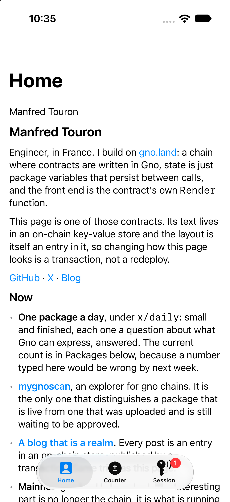
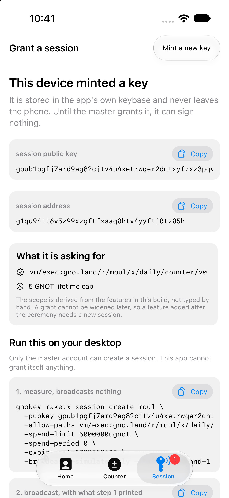
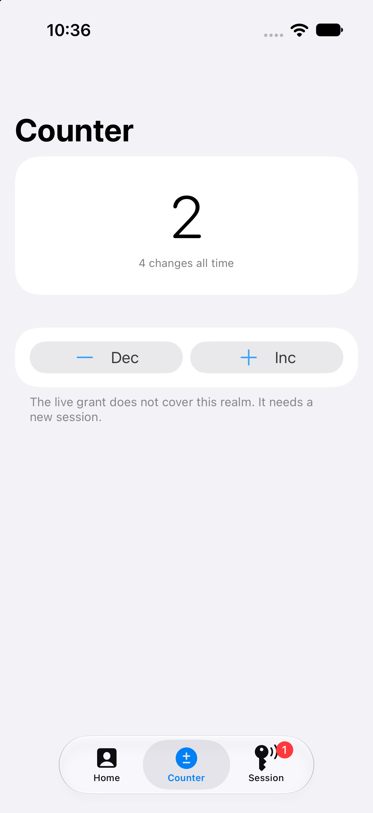

# gno-moul-mobile

A native iOS app for [gno.land](https://gno.land) realms, in Swift and SwiftUI, with no
web view and no JavaScript anywhere in it.

It exists to answer two questions in running code rather than in a design doc:

1. **What does onboarding look like when the phone never holds a master key?**
   The app mints its own key, shows you the one command that grants it, and unlocks itself
   when the chain confirms. The grant is scoped to the realms this build actually has
   features for, with a spend limit it declares up front.
2. **What does it cost to add the next feature?** One file and one line.

  

## What it does today

- Reads `gno.land/r/moul/home` and renders its `Render()` markdown natively.
- Reads `gno.land/r/moul/x/daily/counter/v0` with `vm/qeval`, and moves it with a
  session-signed transaction.
- Mints a session key in its own encrypted keybase, derives the `gpub…` the grant needs,
  watches the chain, and activates itself the moment the grant lands.
- Shows the grant back as the chain has it: allowed paths, spend limit, what is spent,
  when it expires.

Reading needs no session at all, so the app is useful before the ceremony and the grant
lives in its own tab.

## How it is put together

```
Sources/GnoKit      the Swift face of the gno core: bridge, typed calls, errors, bech32
Sources/MoulApp     SwiftUI. One file per feature, plus the onboarding
Tests/GnoKitTests   unit tests, plus four that run the real core in-process
```

The chain work is done by [Gno Native Kit](https://github.com/gnolang/gnomobile): its Go
core is compiled to `GnoCore.xcframework` and runs inside the app. There is no server
between the phone and the chain.

**There is no gRPC client here, and no generated code.** The core's bridge takes a method
name and a JSON string and hands back base64 JSON:

```swift
bridge.invokeGrpcMethod(promise, method: "Render", jsonMessage: #"{"package_path":"gno.land/r/moul/home"}"#)
```

Requests are decoded by `protojson`, which accepts the original proto field name; replies
are encoded by Go's `encoding/json`, whose tags are that same name. So both directions are
snake_case and one `JSONEncoder`/`JSONDecoder` pair covers the whole API. `GnoClient` is
that pair plus one `struct` per call.

### Adding a feature

A feature is a descriptor and a screen:

```swift
enum BlogFeature {
    static let descriptor = FeatureDescriptor(
        title: "Blog",
        blurb: "gno.land/r/moul/blog",
        symbol: "text.book.closed",
        realm: "gno.land/r/moul/blog",
        writes: false,
        budget: 0
    )
    static let feature = Feature(descriptor: descriptor) { AnyView(BlogView(model: $0)) }
}
```

Add it to `Features.all` and it appears as a tab. If `writes` is true, its realm is
automatically added to the scope the app asks for, and its budget to the spend limit: the
session request is derived from the build, never typed by hand.

A grant **cannot be widened**, so a feature added after the ceremony stays visibly locked
until a new session is created. The app says which realms are uncovered rather than letting
you press a button whose transaction the chain will refuse.

## Build it

Needs Xcode 26 or later, a Go toolchain, and `xcodegen` (`brew install xcodegen`).

```
make run
```

That builds the Go core from a pinned gnomobile commit (about 10 minutes the first time,
cached after), generates the Xcode project, builds the app and launches it on a simulator.

```
make framework   # just the Go core
make project     # just the Xcode project
make test        # unit tests + the in-process core tests
make list        # everything
```

The `.xcodeproj` is generated from `project.yml` and is not committed. `GnoCore.xcframework`
is 305 MB and is not committed either.

## Things worth knowing, all of them measured

- **A session delegates signing, not identity.** `OriginCaller` and the bank both see the
  master. A realm that pays its caller pays the master; a storage refund lands there too.
  So a session cannot stand in for a third party.
- **Granting is two commands, not one.** The app cannot size that transaction: simulating it
  needs the signature slot to carry the master's pubkey, and putting the master on the phone
  is the thing the whole design avoids. Offering the session's own key instead is refused
  with `ErrUnauthorized(#202)`. Everything the app *signs* is sized from a simulation, because
  there it holds the key.
- **A simulated transaction cannot carry `gas_wanted: 0`**; the chain answers
  `invalid gas wanted`. It is raised to the chain's consensus `MaxGas` (3,000,000,000 on
  mainnet, read 2026-09-30) for the simulation, and the measured value is written back
  before signing.
- **A session address answers nothing on its own.** `auth/accounts/<session>` returns null;
  only `auth/accounts/<master>/session/<session>` answers, which is why `sessionAccount`
  takes both.
- **A trailing version digit is not a path segment.** A grant on `…/counter` does not cover
  `…/counter2`, and `GnoSessionAccount.covers` matches accordingly.
- **Go writes its replies with `omitempty`**, so every zero is simply absent. A local key's
  `type` is 0, which means a required field there would fail to decode every key there is.
- **gomobile's framework needs two fixes before Xcode will embed it**: it emits a versioned
  macOS-style bundle where iOS wants a shallow one, and an empty `Info.plist`.
  `scripts/flatten-xcframework.sh` does both, idempotently.
- **`gomobile bind` runs `go mod tidy` in a generated module with no `go` directive**, so
  `GOTOOLCHAIN=auto` leaves it on the host's base toolchain and the build fails with
  "requires go >= 1.24.0 (running go 1.23.8)". The Makefile pins it.
- **The Go runtime needs `-lresolv`** on iOS, or the link fails on `_res_9_ninit` with
  nothing in the message about Go.

## Not yet

Android and React Native are deliberately out of scope for now. Images in realm markdown
render as their alt text. The app talks to mainnet only.

## Licence

MIT.
